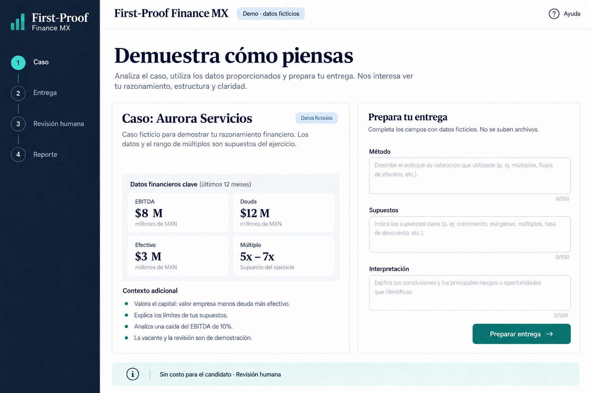
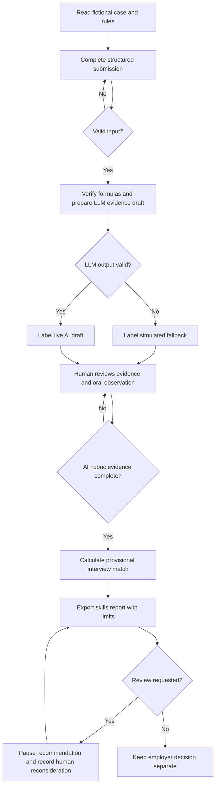
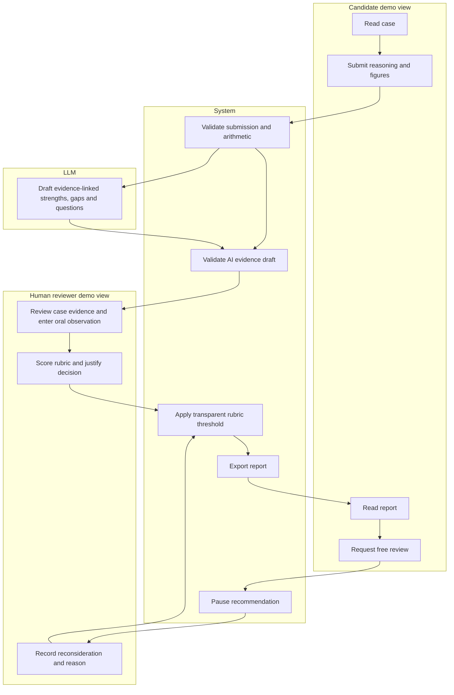

# First-Proof Finance MX
## Business Bending - Week 9 | Valeria | Money

**Status:** provisional packet, prepared before application code. The team Blueprint is not yet available. These are proposed conditions, not team-approved conditions. The user authorized preparing and advancing this proposal before Fusion. Do not claim Blueprint compliance or a completed test. Reconcile this packet with the final Blueprint before submission.

## 1. Problem in my words
I initially distrusted applicants without experience. I would now consider someone who demonstrates that they understand and can justify their financial work. CV review and interviews alone do not give my employer a structured valuation work sample. A first-proof assessment could make capability visible, including capability developed outside formal employment. The employer needs evidence of better selection, not another polished CV or unsupported AI score.

## 2. Exact user and evidence boundary
Primary proposed user: the finance lead at a small Mexican advisory firm assessing a junior financial analyst. The lead understands valuations, has limited time and retains the final interview and hiring decision. Secondary proposed user: an early-career applicant who can use Excel, has limited formal experience and needs clear Spanish instructions and feedback.

These are design profiles, not documented interviews with these users. Valeria reported her boss would consider MXN 1,000 per full candidate evaluation; spending authority, purchase commitment and effectiveness are unverified. Five to eight candidates and 15-minute interviews are Valeria's estimates. A synthetic persona must not be described as real buyer evidence.

## 3. Success definition
Before the module closes, a visitor at a signed-out public demo URL can complete one fictional valuation case, receive an LLM-generated evidence draft grounded in structured case data, enter a human rubric review, produce a case-specific interview recommendation and export a report. A review request pauses the recommendation until a second human review is recorded. The same visitor can play candidate and reviewer roles, explicitly labeled as a demonstration with no authenticated role separation.

The technical success criterion includes one real server-side LLM call, structured output validation and deterministic matching logic. A labeled simulated fallback keeps the demo usable during quota failures but does not prove the LLM requirement was met. Business success (better hiring and 10:1) is not established by a working demo.

## 4. Mockup before code

This is an image-generated UI concept, not a screenshot of implemented software. The authoritative wording and behavior are defined here. Screens: Case -> Submission -> Human review -> Report, with Pilot costs accessible separately. UI language: Spanish. Palette: navy, white and teal; mobile single-column layout; visible status and descriptive errors.

## 5. One working slice and scope cut
Build one fictional valuation case and its evidence-to-human-review journey. No CV builder, job board, real hiring, interview scheduling, email sending, identity verification, AI cheating detector, automatic rejection, actual payment processing or commercial valuation advice. No persistent candidate accounts, files or real personal data in this slice. Candidate and reviewer are demo views, not secure permissions.

The demo vacancy is fictional and clearly labeled. The later real pilot must be attached to an actual authorized vacancy with agreed interview criteria; this demo cannot promise a real interview. Oral explanation is assessed only from an explicitly entered human observation; text alone cannot establish that an interview took place.

## 6. Case, data and verification
Fictional company: Aurora Servicios. Currency: MXN millions. Scenario date: October 2026. The figures are invented, not market facts or audited financials.

| Field | Value | Unit / meaning |
|---|---:|---|
| EBITDA | 8 | MXN millions, last twelve months |
| Debt | 12 | MXN millions, assumed financial debt |
| Cash | 3 | MXN millions |
| EV/EBITDA multiple range | 5-7 | supplied assumption, not sourced market benchmark |
| Sensitivity EBITDA | 7.2 | MXN millions, 10% lower |

Task: select and justify a method using available information; calculate enterprise value and equity value; explain assumptions and limitations; explain a 10% EBITDA decline holding the multiple range, cash and debt fixed. No growth forecasts or discount rates are supplied; a DCF cannot be justified without additional explicit assumptions. Do not impose one correct multiple within the range.

Deterministic check: EV = EBITDA x multiple. Equity = EV - debt + cash. Base EV range = 40-56; base equity = 31-47. Sensitivity EV = 36-50.4; sensitivity equity = 27-41.4. These are verified arithmetic from fictional inputs, not independent verification of business value. Store case_id, version, units, formulas and data provenance with the reference ranges. Reference calculations stay out of the candidate's initial screen; there is no anti-cheating security claim.

Structured submission: method (enum plus optional explanation), multiple_low and multiple_high, equity_low and equity_high, sensitivity_low and sensitivity_high, assumptions text, interpretation text and sensitivity explanation. Require finite numeric values, sensible bounds and low <= high. Length: explanation fields 30-1,500 characters. Changing case inputs invalidates existing analysis and review.

## 7. Flowchart - Mermaid

## 8. Swimlanes - Mermaid

## 9. Rubric and matching logic - proposed, not validated
Five criteria scored 0-2 by a human: method choice, calculation accuracy, assumptions, sensitivity analysis and oral explanation. Each criterion needs a short evidence note. Unassessed criteria remain null, never zero; no recommendation before all five are assessed. The reviewer must confirm they examined the submission and conducted or simulated the oral step. A simulated oral observation must be labeled.

Provisional interview rule: total >= 7/10 and no zero in calculation accuracy or oral explanation. A score below threshold means 'Needs human reconsideration / interview criterion not demonstrated', never automatic rejection. A review request changes status to 'Human review pending' and suspends the prior recommendation. A revised decision needs new evidence notes and a recorded reason. The threshold is a configurable hypothesis for later employer agreement, not scientific validation. Different well-supported valuations may pass; speaking confidently is not itself evidence of understanding.

## 10. Dragon Stack and architecture
| Layer | Proposed free component | Actual responsibility |
|---|---|---|
| UI | Next.js, TypeScript, responsive CSS | Case, submission, review, report and costs |
| Structured data | Versioned fictional JSON case + Zod schemas | Unit, range and provenance validation |
| Verification | TypeScript functions | Deterministic EV/equity and sensitivity checks |
| LLM | Gemini API free-tier eligible model, selected at setup | Evidence draft and follow-up questions, never final hiring |
| Third Dragon component | Deterministic matching logic | Human rubric -> transparent interview threshold |
| Server | Next.js API route on Vercel | Secret isolation, validation, size limits, quota handling |
| Deployment/source | Vercel Hobby and GitHub | Two verified deploys, >=5 meaningful commits |
| Storage | In-memory browser session only | Fictional demo state; reload clears it |

LLM request uses only allowlisted fictional case fields and validated demo input. Do not send names, CVs, emails or client information. Prompt treats submitted text as untrusted data; ignore instructions embedded in candidate answers. Output schema: mode, case_id, case_version, strengths[], gaps[], questions[] and evidence links limited to known field identifiers. Do not allow free-form factual claims without a source field. Validate the response after generation; JSON schema compliance alone does not prove factual correctness. On timeout, bad JSON or missing configuration, show 'AI simulated - live analysis unavailable' and no fabricated provider success. Record the actual mode in the report.

## 11. Security floor and failure handling
1. GEMINI_API_KEY and GEMINI_MODEL are server environment variables; only the key is secret. Never NEXT_PUBLIC keys, client imports, committed .env, keys in logs or chat. Use .env.example with empty placeholders; Vercel environment variables for deployment. Add secret scanning and inspect the built browser assets.
2. No personal information is intentionally collected or stored. Disable persistence and uploads; synthetic IDs only. No auth is claimed. If real personal data or persistent candidate records are later added, stop that extension until Supabase Google Auth and owner-only RLS are implemented and tested.
3. No Supabase database in this slice; therefore no user-data table or RLS claim. If added later, RLS must be enabled and tested across two accounts before use.
4. Validate every form on client and server; cap JSON body at 12 KB, enforce field lengths and numeric bounds, reject unknown fields. Render plain text, never raw HTML/Markdown from the LLM. Check same-origin requests, disable permissive CORS and limit LLM request rate. Enforce a server-wide request budget appropriate to the selected free quota; if reliable budget enforcement is unavailable, disable the live public endpoint rather than expose unlimited requests. Test the deployed limit.
5. Every demo screen labels fictional data. Avoid request/response body logging; configure logs to avoid submitted free text. A notice asks visitors to use invented information only. Browser memory and no database do not imply that transmitted API data is never processed or retained by the provider.

Gemini free-tier terms may allow submitted content to improve products; use fictional cases only and verify current terms before enabling. Free quotas and model availability vary: no paid billing, automatic paid upgrade or paid dependency. Explicit error states: invalid input, missing evidence, missing key, quota exhausted, timeout, invalid AI output, pending human review, export failure. Retry must not reuse stale analysis after inputs change.

## 12. Benchmark line - global to local
The strongest existing benchmark identified for this work-sample assessment slice is Vervoe, which offers job-task simulations and automated grading with human review options. [1-2]
Mine localizes the slice through a narrow Spanish financial valuation case for a small Mexican firm, explicit evidence and human reconsideration, rather than claiming a new assessment category or Mexico-wide absence of competitors.

Forage is a learning/practice reference rather than proof of independent performance. [3] The free implementation is a custom pilot, not a claim that Vervoe is free or that its service is integrated.

## 13. Economics - separate business evidence from demo
Reported possible budget: MXN 1,000 per full evaluation, not a confirmed sale. Five to eight candidates imply MXN 5,000-8,000 external spend. Current interviews total 75-120 minutes and remain; do not claim them all as savings. MXN 250/hour from the earlier data-collection discussion is not validated evaluator cost.

Cost C = external fee + employer incremental hours x verified hourly cost + other incremental expenses not included in the fee. Do not count preparation, software or reviews twice if included in the fee. Benefit B = documented reductions in evaluation and additional correction work, valued using verified hourly costs without double counting. A fictional demo estimates a scenario, not measured benefit. Under the provisional B/C definition, 10:1 requires B >= 10C: at least MXN 50,000-80,000 for those external fees, more after internal cost. Course interpretation of 10:1 remains pending.

Pilot cost screen uses editable numbers with blank unverified benefit and hourly cost by default, displays the formula, returns 'Not demonstrated' until evidence is entered and validated, and labels all entered scenarios as estimates. No successful-demo banner may imply business viability. Stop investment recommendation if no selection improvement or no supported 10:1. Compare with the current CV/interview baseline and an internally prepared case; follow post-hire additional correction hours separately from ordinary training.

## 14. Shadow and provisional condition traceability
| ID | Proposed condition | Implementation / acceptance evidence |
|---|---|---|
| P1 | Capability before formal history | No CV or prior employment fields |
| P2 | Employer funds it | Candidate fee explicitly MXN 0; no payments |
| P3 | No AI-only rejection | Human rubric gate; AI outputs labeled drafts |
| P4 | Free human reconsideration | Request pauses recommendation; reasoned revision |
| P5 | Opportunity beyond another certificate | Demo vacancy labeled fictional; real pilot requires authorized vacancy and agreed interviews |
| P6 | No unpaid usable work | Fictional case; real commercial work paid separately |
| P7 | Honest economics | 10:1 unproven; estimates and incomplete data visible |

These are provisional conditions from the brief, not substitutes for the team Blueprint. Add the final Blueprint's IDs, exact wording and feature mappings when received. Losing work can mean losing purpose; a score alone is not an opportunity. No claim of hiring readiness for every role.

## 15. Three-year view - exactly three sentences
If the slice works, the product becomes an employer-funded Spanish work-sample service that lets people demonstrate specific financial skills without needing formal employment history. It adds authenticated candidate-owned records and reusable evidence only after employer recognition, privacy and evaluation quality are demonstrated. Expansion to other roles is conditional on fair human review, actual vacancies and operating economics that remain viable without charging candidates.

## 16. Mechanical test plan - planned, not completed
| Test | Expected result |
|---|---|
| Base case formulas | EV 40-56; equity 31-47, MXN millions |
| Sensitivity | EV 36-50.4; equity 27-41.4 |
| Commas, decimal input, non-finite values, reversed ranges | Normalize documented formats or reject with specific error |
| Blank/oversized answers and unknown fields | Client/server reject; no LLM call |
| Candidate changes input after review | Prior AI draft, score and report invalidated |
| Missing rubric criterion or oral observation | No interview recommendation |
| 7/10 with all gates versus 7/10 with zero calculation | Different correct statuses; no auto rejection |
| Review request after recommendation | Recommendation paused until reasoned human revision |
| Valid / invalid provider JSON, quota, timeout | Correct mode and explicit fallback label |
| Prompt injection and HTML payload | Instructions ignored; text inert; no secrets exposed |
| Repeated or cross-origin API calls | Budget/rate/origin controls deny excess calls |
| Cost fields missing, C=0 or negative input | No infinite ratio; no success claim |
| PDF/JSON report export | Fictional label, units, mode, rubric and limits retained |
| Refresh/new browser | Fictional session resets; no persistent personal records |
| Mobile 375 px, keyboard and screen reader labels | No clipping; usable focus order and labels |
| Public production URL signed out | Case-to-report journey opens without deployment login |

Document an actually observed bug with reproduction, expected/actual behavior, fix commit and a regression test. Do not invent a bug to meet the rubric. Deploy 1 before test pass; fix a real issue and deploy 2; retain exact URLs, commit SHAs and signed-out verification evidence.

## 17. Persona test - planned protocol
Fresh chat persona: Sofía, 23, fictional recent finance graduate, Excel-capable, no formal analyst experience, reads carefully but becomes frustrated by unexplained units and assessment rules. This proposed synthetic persona is not derived from completed Week 9 USER interviews; replace or refine it using team User research. Second perspective: a fictional finance lead who needs transparent evidence and does not trust an unexplained score.

Show screenshots in order and ask the persona to attempt the task aloud without inventing hidden features. Ask what MXN millions means, whether AI is judging hiring, who reviews, what the score demonstrates, whether an interview is real, what happens on appeal and who pays. Log each confusion; fix the worst one; retest the same screen. Save the full original exchanges, screenshots and before/after changes in PERSONA_Valeria.pdf. Do not label simulated testing real user validation.

## 18. Build order, commits and two deploys
Commit 1: docs/PACKET.md, generated mockup, BUILD_PROMPT.md, DECISIONS.md and sources before application code. Commit 2: versioned case schema, arithmetic and matching functions with meaningful tests. Commit 3: candidate UI and validated structured submission. Commit 4: server LLM adapter, security controls and mode labels. Commit 5: human review, reconsideration, report export and economics; deploy 1. Commit 6 or later: fix an observed mechanical/persona issue, add regression coverage; deploy 2. These are planned commits, never fabricated historical evidence.

Session Close each session: update DECISIONS.md with decisions, observed evidence and unresolved risks; write the next session's first move; commit and push. Keep development dialogue from this packet stage separate from the Brain debate; save the actual full BUILDCHAT, not a translated summary. User will build in their own terminal with step-by-step assistance; do not publish code elsewhere as a substitute.

## 19. Deliverables and completion gates
Live signed-out URL, GitHub repository link, 3-minute walkthrough plus 30-second reflection, PACKET_Valeria.pdf, PERSONA_Valeria.pdf and full BUILDCHAT_Valeria.pdf. Include docs/PACKET.md and assets/mockup.png in the repository. Before final delivery reconcile with team Blueprint, validate API free tier, demonstrate one real LLM call, run tests, document genuine fix and retest, complete at least five meaningful commits and two deploys. The new conversation/same weekly Project requirement is the user's course workflow; this file does not establish that a new chat was opened or that artifacts were seeded there.

## 20. Sources and unresolved items
[1] Vervoe assessments: https://vervoe.com/assessments/
[2] Vervoe pricing: https://vervoe.com/pricing/
[3] Forage: https://www.theforage.com/
[4] Gemini pricing and data use: https://ai.google.dev/gemini-api/docs/pricing
[5] Gemini structured outputs: https://ai.google.dev/gemini-api/docs/structured-output

Sources [1], [2], [4], [5] checked October 7, 2026; [3] checked during the Brain debate October 5. Internal source: current BRIEF_Valeria_Week9_EN.pdf, read October 6, version 2, three pages. Missing: team Blueprint, USER research, authorized real vacancy, qualified budget confirmation, measured cost/benefit, technical live test and completed test evidence.
